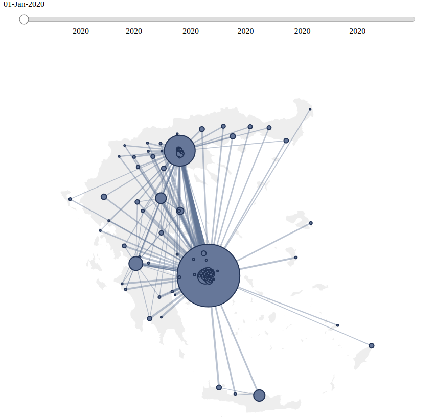
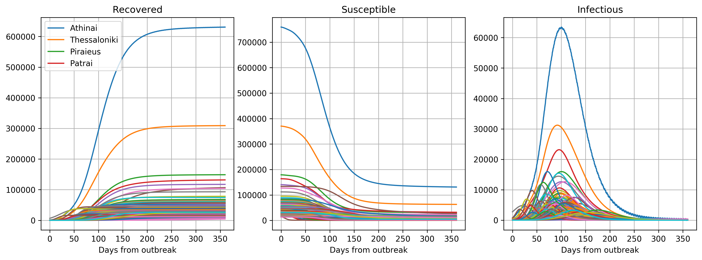

# covid19-SEIR-model
A SEIR model for COVID19 in closed communities.
You can interactively use the ipython widgets from within the notebook to see the effect of changes in the parameters and the importance of containment on the peak of the epidemic.
 
See jupyter notebook for more info, selection of parameters, model etc.

You can try the notebook without installing jupyter on your machine by running it in google colab:

# Graph SEIRS Model
This is an attempt to model transmission between cities. 
A graph is created with big cities as its nodes. The 
modeling assumption is that the reproductive rate is slightly 
different among cities (different population densities, different 
businesses) and that the bigger cities are the first to 
get cases (from airports).

The model assumes population flows between two cities that is proportional to the population of the cities and inversely proportional to the distance between them. This approximation can be potentially removed by considering the actual flows computed by ministry of transportation. In the same framework one may model also the increased exposure rate when traveling by public transportation. 

Do not take this model for any decision making - it's not calibrated and the predictions are most likely wrong! This is implemented with the hope of jump-starting the work of other researchers that may find it useful. 
